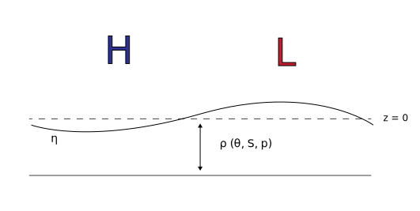

Inverse Barometer Effect
==============================

The **inverse barometer** effect on sea level is the ocean’s response to pressure and density variations at the surface.  Pressure perturbations dominate this effect and can arise from atmospheric variability or ice coverage.  The inverse barometer effect is represented by:

.. math::
  \eta^{ib} = \frac{{-P^{\prime}}_{atm}}{\rho(\theta,S,p) * g}

Where :math:`P^{\prime}` is often expressed as pressure anomaly relative to a time mean state and :math:`\rho` is the density at the ocean surface.  In practice, it is common to consider :math:`\rho_{\sigma=0}` as this quantity is commonly saved from ocean models, although the calculation of in-situ density is considered slightly more precise.

  **Figure** The inverse barometer effect. Positive surface pressure anomalies lead to a depression of the sea surface height (:math:`\eta`) while negative anomalies lead to an elevation of :math:`\eta`.

Effect from Sea Ice Loading
----------------------------------------------------
The effect of sea ice loading is commonly expressed as a surface pressure anomaly that is imparted on the ocean surface.  MOM6 currently corrects for the inverse barometer effect of sea ice and accounts for this weight when reporting its sea surface height diagnostic (`zos`).  Once the effects of sea ice are removed, `zos` for each model grid point is reported as a deviation from the global mean such that the average of `zos` at every diagnostic time step is 0.

The pressure anomaly is applied to the ocean’s free surface.  To account for situations where the free surface (:math:`\eta`) is less than :math:`z=0`, a sea water pressure equal to half of the sea ice pressure anomaly is used when calculating a mean :math:`\rho` within the free surface layer.

Effect from Atmospheric Pressure Changes
-----------------------------------------------------
Most, if not all ocean models assume an atmosphere with zero mass. The effects of changing atmospheric pressure fields are not explicitly represented when coupling MOM6 to atmospheric forcing.  The inverse barometer effect from atmospheric pressure is commonly diagnosed offline as the extrapolation of surface pressure to mean sea level pressure is prone to error, especially in coarse resolution models (i.e. :math:`\ge` 1 degree), in the vicinity of mountainous terrain, and near coastlines. These errors have been demonstrated to induce spurious ocean currents (`Arbic 2005 <https://agupubs.onlinelibrary.wiley.com/doi/10.1029/2004GL021668>`_).

The inverse barometer effect on sea level from atmospheric pressure is not negligible — especially when considering synoptic scale weather variability and extreme events such as storm surge.  One millibar (1 hPa) of atmospheric pressure change leads to approximately 1 cm of sea level change.  Low atmospheric pressure induces sea level rise while high atmospheric pressure depresses the ocean surface. Atmospheric changes can be transient and associate:d with weather events on daily to weekly timescales, although long-term shifts in the strength or position of atmospheric air masses can lead to inverse barometer changes at climate timescales.

References
----------
* Arbic, B. K, 2005:  Atmospheric forcing of the oceanic semidiurnal tide. *Geophysical Res. Lett.*, **32**, `https://doi.org/10.1029/2004GL021668 <https://doi.org/10.1029/2004GL021668>`_
