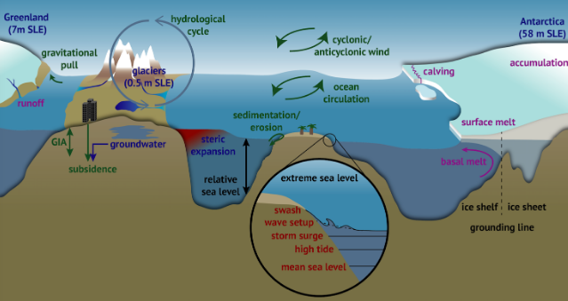

Package Objectives
==================
Sea level is a the net result of several different ocean processes and changes in sea level from weather to climate timescales have important societal impacts. This package aims to curate routines that diagnose sea level and related processes in the MOM6 ocean model.

Processes Driving Sea Level
---------------------------
The kinematic sea level equation decomposes sea level change into changes induced by adding or removing mass, changing ocean dynamics, and steric (i.e. density-driven) changes:

.. math::
    \frac{\partial \eta}{\partial t} = \frac{Q_m}{\rho(\eta)} - \nabla \cdot \mathbf{U} - \int_{-H}^{\eta} \frac{1}{\rho} \frac{\mathrm{d} \rho}{\mathrm{d}t} \mathrm{dz}

Not all of the processes contributing to sea level rise are present in MOM6. Notably, the effects of vertical land motion are not considered and the model assume a globally constant gravitational acceleration. MOM6 does not presently include the meltwater contributions from land-based glaciers and ice sheets.  However, changes in the freshwater balance (:math:`P-E+R`), steric effects, and changing ocean currents are represented.

    **Figure:** Processes that contribute to changes in sea level. From IPCC Special Report on Ocean and Cryosphere, Chapter 4, Oppenheimer et al., 2019.

.. note::
    The majority of climate model simulations performed with MOM6 are configured with the hydrostatic primitive equations in Boussinesq form. Aside from the model's free surface, ocean volume in a conserved quantity. In the above kinematic sea level equation, the steric changes are represented in `non-Boussinesq` form.  Diagnosing steric contributions to sea level in Boussinesq models requires offline approximations that are detailed later in this documentation.

Elements of the Package
-----------------------
The **momlevel** package covers the following sea level routines:

* Global and local steric, thermosteric, and halosteric change
* Dynamic sea level (SSH)
* Mass change diagnosed via bottom pressure

Only the steric routines are implemented. The remaining elements are still in development.