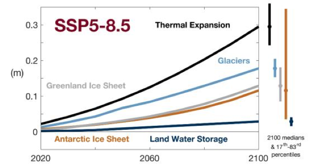

Global Steric Sea Level Change
==============================

**Steric** sea level changes, and more precisely the temperature-driven **thermosteric** sea level changes are projected to the dominant contributor to global sea level rise over the coming century.

The steric changes are evaluated by taking the time derivative of the kinematic sea level equation and assuming zero mass change.  The changes in density are then evaluated relative to an initial reference state.  The steric changes imply that `in situ` denisity is a function of the time-evolving temperature and salinity fields. (Pressure is assumed to be constant in time in this software package and it defined as :math:`p = z * 1.e4`)

The **steric** change calculations assume the in-situ density is a function of potential temperature, salinity, and pressure, i.e. :math:`$\rho(\theta,S,p)$`.  If one were interested in diagnosing the *thermosteric* or *halosteric* adjustments, they could be calculated by holding temperaure or salinity constant at their initial values, i.e. :math:`$\theta^{0}$, $S^{0}$`.

  **Figure:** Projected contributions to 21st century global sea level rise under the high emissions SSP5-8.5
  forcing scenario.  Adapted from Figure 9.26, IPCC Sixth Assessment Report WGI, Fox-Kemper et al., `in press`.

We approximate the steric sea level change in Boussinesq MOM6 configuration by assuming the global ocean volume is nearly constant.  We can then use the following relationships to diagnose the local and global mean steric changes.  For a complete derivation of these relationships, please see the appendicies of Griffies and Greatbatch (2012) and Griffies et al. (2014).

Local Steric Sea Level Changes
----------------------------------------------------
The local (i.e. grid point) steric changes in sea level are approximated by:

.. math::
  \eta^{steric}(\tau) = \eta(\tau_{ref}) - \frac{1}{\rho_0}\sum \mathrm{dz} [\rho(\theta,S,p) - \rho(\theta_{ref},S_{ref},p_{ref})]

Where:

* :math:`\eta^{steric}(\tau)` is the sea level change at time :math:`\tau`
* :math:`\eta(\tau_{ref})` is sea level height at the reference state
* :math:`\rho_0` is the global constant reference density (By default, 1035 kg/m3)

This relationship is used in **momlevel**.  It is common to represent the local steric changes as anomalies from the global mean (see below) in order to highlight regional patterns.

Global Steric Approximation for Non-Boussinesq Models
-----------------------------------------------------
When considering the `global` steric sea level change in a non-Boussineq model, we can once again assume no material mass change and we can also assume that the global effects of dynamical changes (i.e.  :math:`- \nabla \cdot \mathbf{U}`) are constant.

The time derivative of the kinematic sea level equation can be expressed as:

.. math::
  \eta^{B}_{diag}(\tau) \approx \eta^{B}(\tau) + \frac{V^{0}}{A} \ln\left(\frac{\langle\rho\rangle^{0}}{\langle\rho(\tau)\rangle}\right)

Where:

* :math:`\eta^{B}_{diag}(\tau)` is the diagnosed sea level in a non-Boussinesq model at time :math:`\tau`
* :math:`V^{0}` is the initial reference volume of the global ocean
* :math:`A` is the global surface area of the ocean
* :math:`\langle\rho\rangle^{0}` is the initial global mean density
* :math:`\langle\rho(\tau)\rangle` is the global mean density at time :math:`\tau`.

It is important to note that this relationship is not valid for calculating the local steric contributions to sea level change.  At local scales, the assumption that :math:`\frac{\partial V}{\partial t} = 0` is no longer valid.

.. note::
   This CMIP variable **zostoga** (`global_average_thermosteric_sea_level_chage`) for MOM6 is calculated with this approximation offline using monthly values of potential temperature, practical salinity, and cell volume on the model's native grid.

This method of approximating the non-Boussineq steric adjustment is one of several methods present in the literature. There is virtually no difference among these different methods when estimating :math:`\eta^{B}_{diag}(\tau)`.  For a complete derivation of this method and the other alternatives, see `Griffies and Greatbatch (2012) <https://www.sciencedirect.com/science/article/pii/S1463500312000637?via%3Dihub#s0380">`_.