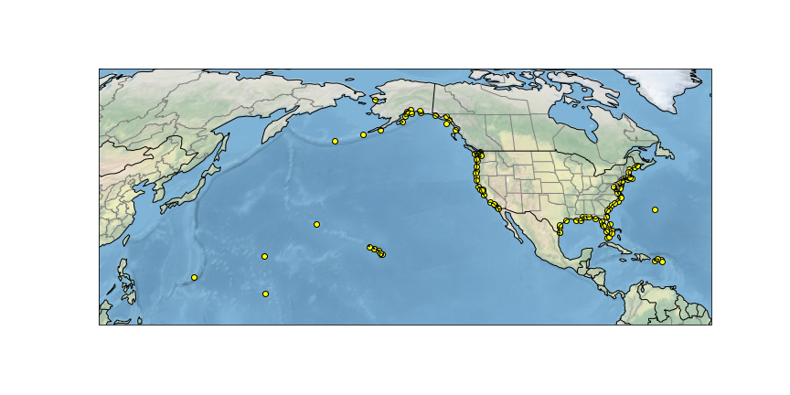

Tide Gauge Locations
=========================================
The **momlevel** package includes functions for extracting ocean model output at specific tide gauge locations. The functionality takes into account the irregular grids common to ocean model output to find the best match between point locations and corresponding grid points. The **momlevel** package includes a default set of US-based tide gauge locations although users may specify their own locations.

  **Figure 1:** United States tide gauge locations included in **momlevel**. Locations correspond to those considered in the projections provided by the Interagency Sea Level Rise Technical Report, `Sweet et al. (2022) <https://oceanservice.noaa.gov/hazards/sealevelrise/sealevelrise-tech-report.html>`_.

Issues with Point Extraction
----------------------------
Ocean model output is typically presented on irregular grids such that the spacing between grid points in the x and y directions is not guaranteed to be uniform. These grids have 2-dimensional coordinate variables, e.g. ``geolat`` and ``geolon``, that describe the true coordinates of the model grid points.

.. warning::
    The ``geolon`` and ``geolat`` variables from MOM6 output represent the true coordinates of the grid cell. These variables should always be used when referencing the model output to real-world locations, such as for plotting and for point extraction.

    The ``geolon`` and ``geolat`` variables are grid `coordinates`. This is notably different from the grid `dimensions`, e.g. ``xh`` and ``yh``. Despite the latter having real-world resemblance, the grid dimensions can be more appropriately thought of as array indices.

    Incorrect results can result when the ``xarray.core.DataArray.sel()`` method is used to extract grid points using the array-relative `xh` and `yh` dimensions.

Tide gauges are often located along coastlines at the interface between the land and ocean. Sometimes the nearest model grid point to a point location is not a valid ocean point. The tide gauge extraction in **momlevel** searches for the nearest `valid ocean grid point`.

Users can also specify a maximum distance between a real-world location and a model grid point. A threshold of 1.5 times the nominal model horizontal grid spacing is recommended for most applications. The distance between a point location and a model grid cell is calculated using a haversine, or great-circle, distance.

Example Usage
-------------
In this example, daily maximum sea surface height (``ssh_max``) is extracted for tide gauge locations in the Mid-Atlantic Bight. The sample model data for this example are spatial and temporal subset of a Regional MOM6 simulation run at 1/12-degree resolution

Loading Sample Data
^^^^^^^^^^^^^^^^^^^
.. jupyter-execute::

  import xarray as xr
  import momlevel
  import matplotlib.pyplot as plt
  import pkg_resources as pkgr
  %matplotlib inline

  example_dataset = pkgr.resource_filename(
      "momlevel",
      "resources/NWA12_sample_grid_data.nc"
  )
  ds = xr.open_dataset(example_dataset)
  ds

The ``wet`` mask for this dataset illustrates a mixture of land, ocean, and undefined points:

.. jupyter-execute::

  fig = plt.figure()
  ax = plt.subplot(1,1,1,aspect=0.7,facecolor="gray")
  ax.pcolormesh(ds.wet,cmap="winter_r")

Extracting Data at Tide Gauge Locations
^^^^^^^^^^^^^^^^^^^^^^^^^^^^^^^^^^^^^^^
.. jupyter-execute::

  ds_tide_gauge = momlevel.extract_tidegauge(
      ds.ssh_max,
      ds.geolon,
      ds.geolat,
      mask=ds.wet,
      threshold=13.75
  )

  ds_tide_gauge

Each array in the output dataset includes additional attributes that describe the results of the translation of point locations to the model grid:

* ``name`` : Site name, also the same as Permanent Service for Mean Sea Level (PSMSL) station name
* ``NOAA_name`` : NOAA tide gauge station name
* ``PSMSLID`` : Permanent Service for Mean Sea Level station id number
* ``NOAAID`` : NOAA tide gauge station id number
* ``distance`` : distance between tide gauge location and grid cell center, in km
* ``mod_index`` : integer index of the model's flattened x-y grid array
* ``model_coords`` : lat-lon coordinates from the model grid (i.e. ``geolat``, ``geolon``)
* ``dims`` : y-x dimension names
* ``dim_vals`` : y-x dimension values from the model grid (i.e. ``yh``, ``xh``)
* ``real_coords`` : real coordinates of tide gauge location

Plotting Location Timeseries
^^^^^^^^^^^^^^^^^^^^^^^^^^^^
.. jupyter-execute::

  fig = plt.figure()
  ax = plt.subplot(1,1,1)
  for var in ds_tide_gauge.keys():
      var = ds_tide_gauge[var]
      (var - var.mean()).plot(ax=ax,label=var.NOAA_name)
  plt.legend()
  ax.set_ylabel("Sea Surface Height Anomaly [m]")
  ax.legend(bbox_to_anchor=(1.05, 1))

References
----------
* Sweet, W.V., B.D. Hamlington, R.E. Kopp, C.P. Weaver, P.L. Barnard, D. Bekaert, W. Brooks, M. Craghan, G. Dusek, T. Frederikse, G. Garner, A.S. Genz, J.P. Krasting, E. Larour, D. Marcy, J.J. Marra, J. Obeysekera, M. Osler, M. Pendleton, D. Roman, L. Schmied, W. Veatch, K.D. White, and C. Zuzak, 2022: Global and Regional Sea Level Rise Scenarios for the United States: Updated Mean Projections and Extreme Water Level Probabilities Along U.S. Coastlines. NOAA Technical Report NOS 01. National Oceanic and Atmospheric Administration, National Ocean Service, Silver Spring, MD, 111 pp. `https://oceanservice.noaa.gov/hazards/sealevelrise/noaa-nos-techrpt01-global-regional-SLR-scenarios-US.pdf <https://oceanservice.noaa.gov/hazards/sealevelrise/noaa-nos-techrpt01-global-regional-SLR-scenarios-US.pdf>`_